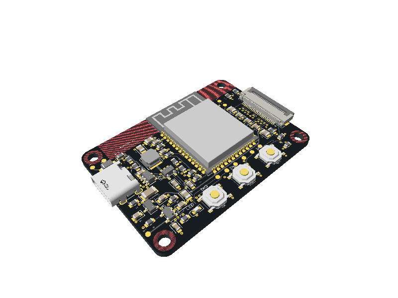

# MuseView V1

ESP32-S3-WROOM-1-N16R8 camera controller, standard USB-C **5 V only**, Arducam M0031 24-pin OV2640 camera, ASK/CAPTURE button and status LED. No USB Power Delivery controller, voltage request, battery charger or 9 V input.



Engineering prototype with complete routed copper and reproducible checks. **Order hold: exact M0031 flex qualification and physical bring-up remain open; do not order from the superseded 1.197 V revision.** Manufacturing files are in [`release/`](release/); the external camera is installed separately. Physical bring-up and JLC placement preview remain required.

This repository follows the organization of [techmannih/trellis-core](https://github.com/techmannih/trellis-core): one explicit JSX board entrypoint, local component imports and CAD assets, Bun lockfile, circuit checks under `scripts/`, schematic/PCB/3D snapshots, assembly and bring-up documents. The electrical design is independently implemented for this board; Trellis Core's circuit and physical placement are not interchangeable with this camera board.

## Use

```sh
bun install --frozen-lockfile
bun run verify
bun run dev
bun run build:preview
bun run build:handoff
bun run export:assembly
bun run snapshot
bun run snapshot:3d
bun run export:release
```

The library/CLI is pinned to tscircuit 0.0.2687. Builds use selected supplier numbers, not automatic part substitution. `hardware-contract.json` is checked against the generated source netlist. `scripts/check-decoupling.mjs` measures actual local copper. Placement, routing diagnostics and a separate Gerber copper short check must pass before a release can be considered.

## Design

- 50 × 35 mm, 1.6 mm FR4, four copper layers, black solder mask, **all 49 fitted components on top; no bottom assembly**.
- L1 components/signals, L2 ground reference, L3 common MCU/camera I/O power, L4 signals. Antenna keepout on all copper layers.
- USB-C USB 2.0 device: independent 5.1 kΩ CC pull-downs, USBLC6-2SC6, 33 Ω data resistors, 750 mA PTC, SMF5.0A input TVS.
- TLV62569: **3.192 V nominal** shared ESP32/camera I/O, using 432 kΩ/100 kΩ, both **0.1%**.
- XC6206P282MR: camera analog 2.8 V, supplied from protected USB 5 V to avoid marginal dropout headroom.
- SGM2059: camera core **1.296 V nominal**, using 25.5 kΩ/40.2 kΩ, both 1%. Net: **CAM_1V3**, TP7 acceptance **1.24–1.36 V**.
- Native USB ROM recovery, UART0/JTAG pads, BOOT, RESET, ASK GPIO16 and LED GPIO17.
- Camera RESET GPIO18 defaults low and PWDN GPIO8 defaults high. Firmware must actively release them.

These rail changes correct the source brief's 1.296 V camera core and avoid a marginal 2.8 V camera-to-3.318 V ESP32 I/O interface. See [electrical decisions](docs/electrical-review.md) and the [pin contract](hardware-contract.json).

## Repository

```text
index.circuit.tsx             board, four schematic sheets, placement and copper
pcb-routes.json               reviewed routes, guarded by geometry/net fingerprint
routing/                     native geometry and pinned routing-generation inputs
imports/                     JLC-imported ICs/connectors/CAD; native passives
scripts/                     verification, mutation tests and exports
sourcing/                    timestamped JLCSearch evidence and alternatives
__snapshots__/               reviewed schematic, PCB and 3D renders
docs/                        assembly, electrical review, bring-up, release checks
firmware/                    matching ESP-IDF camera bring-up application
.github/workflows/           automated build/check pipeline
dist/                        generated CAD/manufacturing output (ignored)
release/                     published, versioned handoff files
```

The V1.1 placement follows the supplied visual brief: USB-C on the left, camera flex at the right, antenna toward the top and ASK / RESET / BOOT along the bottom edge. It is independently placed and freshly routed. The 35 mm board height provides room for the actual ESP32 module courtyard and button row; the concept image's 30 mm height is not used. Copper on the bottom is routing only, with no fitted parts.

## Assembly boundary

The external Arducam M0031 camera, USB cable and enclosure are not JLCPCB assembly components. JLCSearch quantities are cached catalogue evidence, not reserved stock or a confirmed assembly quotation. Recheck the selected BOM in JLC's assembly portal immediately before ordering. FPC mating, prototype rail/transient measurements, USB signal integrity and camera capture require hardware validation; successful software checks do not establish those results.

Component import/stock provenance and datasheets: [sources](docs/sources.md). Current validation and open physical checks: [release checks](docs/release-checks.md).

View the four schematic sheets: [USB](release/schematic-usb.svg), [power](release/schematic-power.svg), [MCU](release/schematic-mcu.svg), [camera](release/schematic-camera.svg). Board views: [top](release/pcb-top.svg), [bottom](release/pcb-bottom.svg). Editable manufacturing/CAD exports: [Gerbers](release/museview-v1-gerbers.zip), [KiCad](release/museview-v1-kicad.zip), [STEP](release/museview-v1.step), [GLB](release/museview-v1.glb). See [routing workflow](docs/routing.md) before changing placement or nets.
